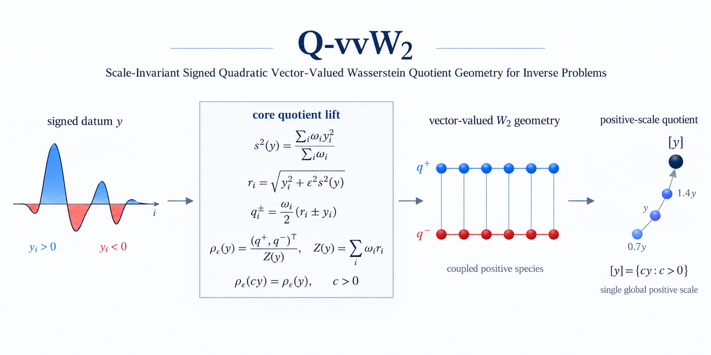

# Q-vvW2

**Scale-Invariant Signed Quadratic Vector-Valued Wasserstein Quotient Geometry for Inverse Problems**


Reference Python implementation of **Q-vvW2** together with six reproducible numerical experiments corresponding to Figs. 1–9 of the associated study.

- [Introduction](#introduction)
- [Installation](#installation)
- [Experiments](#experiments)
- [Reproduction](#reproduction)
- [Repository structure](#repository-structure)
- [Citation](#citation)
- [License](#license)

---

## Introduction

Q-vvW2 is a scale-invariant geometry for signed inverse-problem data in the presence of an unknown **common positive multiplicative gain**. Signed data are lifted to a coupled vector-valued quadratic Wasserstein representation, while the positive-scale quotient removes one global gain over the complete acquisition rather than introducing independent per-shot scale factors.

The accompanying experiments compare Q-vvW2 with `L2`, `Normalized-L2`, `Softplus-W2sq`, `Marginal-W2sq`, `UOT`, and `HV`. The nonlinear elliptic PDE experiment additionally reports a fixed-scale `vvW2` comparison.

<p align="center">
  
</p>

---

## Installation

The validated reproduction environment is specified in `environment.yml`.

```bash
conda env create -f environment.yml
conda activate qvvw2
python -m pip install -e . --no-deps --no-build-isolation
python -m ipykernel install --user --name qvvw2 --display-name "Python (qvvw2)"
```

Optional checks:

```bash
python scripts/check_environment.py
python -m pytest -q
```

---

## Experiments

Each experiment has an independent notebook. The notebooks committed in this release retain the outputs from the validated reference execution, and the final paper figures are included under the corresponding experiment directories.

| Experiment | Status | Notebook | Paper output |
|---|:---:|---|---|
| **E00 — Quotient geometry** | ✅ | [`E00_quotient_geometry.ipynb`](notebooks/E00_quotient_geometry.ipynb) | [Fig. 1](experiments/E00/figures/Fig01_geometry_concept.png) |
| **E01 — Numerical theory verification** | ✅ | [`E01_local_geometry.ipynb`](notebooks/E01_local_geometry.ipynb) | [Fig. 2](experiments/E01/figures/Fig02_theory_verification.png) |
| **E02 — Signed-waveform benchmark** | ✅ | [`E02_signed_waveform_benchmark.ipynb`](notebooks/E02_signed_waveform_benchmark.ipynb) | [Fig. 3](experiments/E02/figures/Fig03_signed_waveform_mechanism.png) |
| **E03 — Distributed nonlinear inverse problem** | ✅ | [`E03_distributed_inverse_problem.ipynb`](notebooks/E03_distributed_inverse_problem.ipynb) | [Figs. 4–6](experiments/E03/figures/) |
| **E04 — Nonlinear elliptic PDE inverse problem** | ✅ | [`E04_elliptic_pde_inverse_problem.ipynb`](notebooks/E04_elliptic_pde_inverse_problem.ipynb) | [Figs. 7–8](experiments/E04/figures/) |
| **E05 — TDEM nonconvex benchmark** | ✅ | [`E05_tdem_multistart_benchmark.ipynb`](notebooks/E05_tdem_multistart_benchmark.ipynb) | [Fig. 9](experiments/E05/figures/Fig09_TDEM_nonconvex_benchmark.png) |

Raw `results/` directories are intentionally not tracked in Git. Re-running a notebook regenerates its raw results and refreshes the corresponding figures locally; the full reproducibility archive is intended for the archived release.

---

## Reproduction

For a complete paper reproduction, run the notebooks independently in the following order:

```text
E00 → E01 → E02 → E03 → E04 → E05
```

The committed notebooks already show the validated reference-run outputs. To reproduce an experiment, open its notebook with the `qvvw2` kernel and run it from top to bottom. Each notebook locates the repository automatically, prepares the local package, clears only its own previously generated `results/` and `figures/`, runs only the corresponding experiment, and displays the newly generated figure(s).

### Marginal-W2sq reference implementation

`Marginal-W2sq` uses the public `waveform-ot` reference implementation accompanying Sambridge, Jackson & Valentine (2022). On first use, qvvw2 downloads and verifies the fixed revision

```text
b4d0b87130a5fef0621f0966994e94db8b18e71a
```

The third-party source is stored under the git-ignored `external/` directory and is **not redistributed** as part of qvvw2 or under the qvvw2 BSD-3-Clause license. The verified local copy is reused on subsequent runs. For troubleshooting only, the same setup can be invoked with

```bash
python scripts/setup_external_baselines.py
```

---

## Repository structure

```text
qvvw2/
├── qvvw2/          # reusable Q-vvW2 implementation and comparison methods
├── experiments/    # E00-E05 experiment code and validated final figures
├── notebooks/      # six executed paper-reproduction notebooks
├── assets/         # README visual asset
├── scripts/        # environment and external-baseline setup utilities
├── tests/          # lightweight API and core numerical checks
├── environment.yml # validated reproduction environment
├── pyproject.toml  # Python package metadata
├── CITATION.cff    # software citation metadata
├── LICENSE
└── README.md
```

---

## Citation

If you use Q-vvW2 in academic work, please cite the associated article once its final bibliographic record is available. Software citation metadata are provided in [`CITATION.cff`](CITATION.cff) and can be rendered by GitHub through **Cite this repository**.

The archival DOI for the final v1.0.0 software release will be added after the release is deposited.

---

## License

Q-vvW2 is released under the **BSD 3-Clause License**. See [`LICENSE`](LICENSE) for the complete terms.
