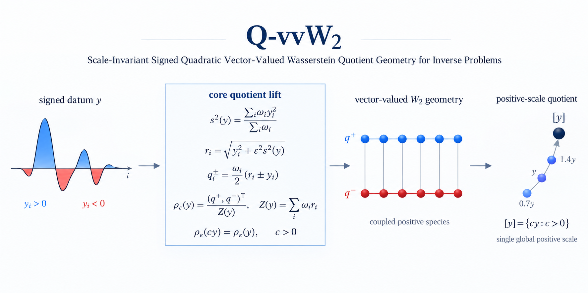

<p align="center">
  
</p>

# Q-vvW₂

**Scale-Invariant Vector-Valued Wasserstein Quotient Geometry for Inverse Problems**

## Overview

This repository accompanies the research manuscript *Scale-Invariant Vector-Valued Wasserstein Quotient Geometry for Inverse Problems*. It provides an installable Python package and six Jupyter notebooks for the experiments underlying Figures 1–10 and Tables 1–2. The notebooks contain outputs saved from actual execution; the computations and figures can also be regenerated from scratch. The repository does not ship precomputed experiment datasets or standalone paper figures.

## Installation

Requires Python 3.10 or newer. Create and activate a virtual environment:

**macOS / Linux**

```bash
python -m venv .venv
source .venv/bin/activate
```

**Windows PowerShell**

```powershell
python -m venv .venv
.\.venv\Scripts\Activate.ps1
```

Then install from the repository root:

```bash
python -m pip install --upgrade pip
python -m pip install -e ".[notebooks,thirdparty]"
```

## Quick start

```bash
python -m jupyter lab
```

Open a notebook under `notebooks/`. Its saved outputs show the results of a completed execution; select **Kernel → Restart Kernel and Run All Cells** to run the experiment on your own machine. Long-running numerical experiments may require substantial CPU/GPU resources.

## Experiments

| Notebook | Experiment | Figures |
|---|---|---|
| `E00_quotient_geometry_and_scale_invariance.ipynb` | Quotient geometry and scale invariance | 1 |
| `E01_numerical_theory_and_derivative_verification.ipynb` | Local geometry and derivative verification | 2 |
| `E02_signed_waveform_objective_sweeps.ipynb` | Signed-waveform objective comparisons | 3 |
| `E03_distributed_wave_inversion_and_mechanism_controls.ipynb` | Distributed-wave inversion, 100-step runs and controls | 4–7 |
| `E04_nonlinear_elliptic_inverse_problem.ipynb` | Nonlinear elliptic inversion and noise studies | 8–9 |
| `E05_tdem_depth_objective_and_multistart_recovery.ipynb` | TDEM depth and multistart recovery | 10 |

All ten paper figures are displayed inside the corresponding executed notebooks. This README intentionally does not duplicate the result images.

## Reproducibility

Notebook cells call the reusable code in `qvvw2/`, with numerical experiment drivers in `experiments/` and plotting utilities in `scripts/`. Rerunning the notebooks computes new results locally; images already stored as notebook outputs are for display only, not computational input. The complete E03 and E04 studies can take substantial time.

After computing all experiments, the command-line plotting entry points can be used:

```bash
python scripts/prepare_fresh_plot_data.py E01 E02 E03 E04 E05
python scripts/make_paper_figures.py --figures 1 2 3 4 5 6 7 8 9 10
python scripts/make_paper_tables.py
```

Generated arrays and figure files stay in locally generated directories that are excluded from Git. E03 can resume verified locally completed tasks, computing missing tasks rather than downloading paper results.

## External baseline

E02, E03 and E05 compare against the Marginal-W₂² implementation in Sambridge and collaborators' [waveform-ot](https://github.com/msambridge/waveform-ot). When needed for the first time, the adapter fetches a **pinned revision** (`b4d0b87130a5fef0621f0966994e94db8b18e71a`) from the authors' repository into a user-side cache; later runs reuse it. Internet access is needed for the first fetch, but installing the Q-vvW₂ package does not itself download this code.

The upstream source is not bundled with, or covered by, this repository's BSD license. For offline installation and full source attribution, see `THIRD_PARTY_PROVENANCE.md`.

## Citation and license

See `CITATION.cff` for software attribution, and cite the accompanying manuscript along with original papers for the comparison methods used. The original Q-vvW₂ software in this repository is distributed under the **BSD-3-Clause License** (`LICENSE`). No publication DOI is claimed before one is assigned.
